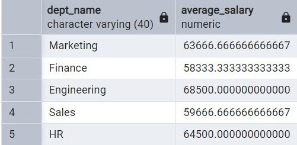
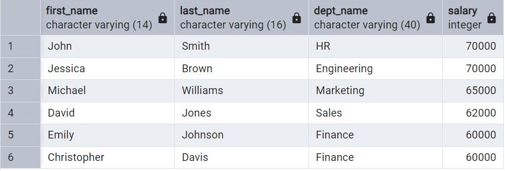

# SQL-Project-Analysis

## Project Objective
In this project, I was tasked with analyzing the employee data of a fictional company to gain insights into various aspects of its workforce. The datasets I worked with contained information aboout employees, their departments, salaries, titles, and managerial position. Using queries and data manipulation techniques, I extracted relevant information from the dataset to present meaningful insights capable of supporting decision-making processes within the organization.

In total, I worked on 30 questions for my analysis and also to get famimliar with standard and andvanced level SQL techniques. I have organized these SQL queries by different types of operations. Each query is designed to answer a specific business or technical problem. Feel free to explore the queries and how they can be applied to real-world scenarios.

## Table of Contents:
1. [Import tables from Excel](#import-tables-from-excel)
2. [Aggregations](#aggregations)
3. [Date and Time Functions](date-and-time-functions)
4. [Joins](joins)
5. [Subqueries](subqueries)
6. [Filtering/Sorting](filtering-/-sorting)
7. [Miscellaneous](miscellaneous)

### Import tables from Excel
The first step when working with datasets from external sources (e.g. csv files) is to import them into SQL. For this project, I was initially given one Excel file titled "Company Dataset" that included 5 worksheets containing relevant data needed for my analysis. Here is my step-by-step approach to importing the data I needed into SQL:
1. I made separate csv files for each of the worksheets
2. I created a table for each of the worksheets using SQL code
3. Lasty, I imported the data for each worksheet (or csv file) into their respective tables

``` sql
-- Import tables from Excel

CREATE TYPE gender_enum AS ENUM ('M', 'F')

CREATE TABLE employees (emp_no int PRIMARY KEY,
			birth_date date,
			first_name varchar (14),
			last_name varchar (16),
			gender gender_enum,
			hire_date date)


CREATE TABLE dept_manager (dept_no CHAR(4),
			emp_no int,
			from_date date,
			to_date date,
			PRIMARY KEY (dept_no, emp_no),
			FOREIGN KEY (emp_no) REFERENCES employees(emp_no),
			FOREIGN KEY (dept_no) REFERENCES departments(dept_no))

select * from dept_manager

CREATE TABLE departments (dept_no CHAR(4) PRIMARY KEY,
			dept_name varchar(40))

select * from departments

CREATE TABLE dept_emp (emp_no int,
			dept_no CHAR(4),
			from_date date,
			to_date date,
			PRIMARY KEY (emp_no, dept_no),
			FOREIGN KEY (emp_no) REFERENCES employees(emp_no),
			FOREIGN KEY (dept_no) REFERENCES departments(dept_no))

select* from dept_emp

CREATE TABLE salaries (emp_no int,
			salary int,
			from_date date,
			to_date date,
			PRIMARY KEY (emp_no, from_date),
			FOREIGN KEY (emp_no) REFERENCES employees(emp_no))

select * from salaries

CREATE TABLE titles(emp_no int,
			title varchar(50),
			from_date date,
			to_date date,
			PRIMARY KEY (emp_no, title, from_date),
			FOREIGN KEY (emp_no) REFERENCES employees(emp_no))

select * from titles
			
			
select * from dept_manager

```
#### Employee Table


#### Dept_Manager Table


#### Departments Table


#### Salaries Table


#### Titles (Job title) Table


### Aggregations
These queries focus on performing calculations involving summary statistics such as averages, sums, counts, max, min, and other aggregates to derive insights from data

``` sql
-- 1. Get the total number of employees
SELECT count(*) AS total_employees FROM employees
```


```sql
-- 2. Find the average salary of employees
SELECT AVG(salary) AS Average_Salary FROM salaries
```


```sql
-- 3. Get the total number of departments
SELECT Count (*) AS Dept_total FROM departments
```


```sql
-- 4. Get the highest salary among all employees
SELECT Max(salary) AS highest_salary FROM employees
LEFT JOIN salaries ON employees.emp_no = salaries.emp_no
```


```sql
-- 5. Find the department with the highest number of employees
SELECT departments_1.dept_name, Count(dept_manager.emp_no) AS num_employees FROM dept_manager
LEFT JOIN departments_1 ON dept_manager.dept_no = departments_1.dept_no
GROUP BY departments_1.dept_name
ORDER BY num_employees Desc
```


```sql
-- 6. Get the average salary for each department
SELECT dept_name AVG(salary) As Average_Salary FROM departments_1
LEFT JOIN salaries on departments_1.emp_no = salaries.emp_no
GROUP BY dept_name
```


```sql
-- 7. Find the total number of employees in each department
SELECT dept_name, Count(emp_no) AS Total_emp_count FROM departments_1
GROUP BY dept_name
```


```sql
-- 8. Get the department number, name, and average salary for departments with more than 3 employees
SELECT dept_no, dept_name, AVG(salary) AS average_salary FROM departments_1 d
LEFT JOIN salaries s ON d.emp_no = s.emp_no
GROUP BY dept_no, dept_name
HAVING COUNT(d.emp_no) > 3
```


```sql
-- 9. Find the Department with the highest average salary
SELECT dept_name, AVG(salary) AS avg_salary FROM departments_1 d
LEFT JOIN salaries s ON d.emp_no = s.emp_no
GROUP BY dept_name
ORDER BY avg_salary DESC
LIMIT 1
```


### Date and Time Functions
These queries demonstrate my ability to use date and time functions to manipulate and filter date values
```sql
-- 11. Retrieve the birthdate and hiredate of the employee with emp_no 10003
SELECT emp_no, first_name, last_name, birth_date, hire_date FROM employees
WHERE emp_no = 10003
```


```sql
-- 12. Retrieve the department number and name where the most recently hired employee works

CREATE TABLE departments_1 AS (select departments.dept_no, 
				departments.dept_name,
				dept_manager.emp_no from departments
			INNER JOIN dept_manager ON departments.dept_no = dept_manager.dept_no)

SELECT a.dept_no, a.dept_name FROM employees e
LEFT JOIN departments_1 a ON e.emp_no = a.emp_no
ORDER BY e.hire_date DESC
LIMIT 1
```


```sql
--13. Retrieve the employee number, first_name, last_name, and title of all employees hired in 2005
SELECT e.emp_no, first_name, last_name, EXTRACT (YEAR FROM hire_date) as Year, title FROM employees e
JOIN titles t ON e.emp_no = t.emp_no
WHERE EXTRACT(YEAR FROM hire_date) = 2005
```


```sql
-- 14. Retrieve the employee number, first_name, last_name and salary of employees hired before the year 2005
SELECT e.emp_no, first_name, last_name, salary, EXTRACT(YEAR FROM hire_date) as Hire_year FROM employees e
LEFT JOIN salaries s ON e.emp_no = s.emp_no
WHERE EXTRACT (YEAR FROM hire_date) < 2005
```


```sql
-- 15. Find the employee with the longest tenure in the company
SELECT emp_no, first_name, last_name, CURRENT_DATE - hire_date AS tenure FROM employees
ORDER BY tenure DESC
LIMIT 1
```


```sql
-- 16. Retrieve the employee number, first name, last name, and title of employees whose hire date is between '2005-01-01' and '2006-01-01'
SELECT e.emp_no, first_name, last_name, title, hire_date FROM employees e
JOIN titles t ON e.emp_no = t.emp_no
WHERE hire_date BETWEEN '2005-01-01' AND '2006-01-01'
```


### Joins
These queries use various types of joins (but predominantly left join) to combine data from multiple tables.

```sql
-- 17. Retrieve the employee number, first name, last name, and department name of employees who have held a managerial position
SELECT e.emp_no, first_name, last_name, dept_name, title FROM employees e
JOIN departments_1 d on e.emp_no = d.emp_no
JOIN titles t on d.emp_no = t.emp_no
WHERE title = 'Manager'
```


```sql
-- 18. Retrieve the employee number, first_name, last_name and department name of employees who are currently working in the finance dept
SELECT d.emp_no, first_name, last_name, dept_name FROM departments_1 d
JOIN employees e ON d.emp_no = e.emp_no
WHERE dept_name = 'Finance'
```


### Subqueries

```sql
-- 10. Find the employee with the highest salary in each department
SELECT first_name, last_name, d.dept_name, salary FROM employees e
JOIN departments_1 d ON e.emp_no = d.emp_no
JOIN salaries s ON d.emp_no = s.emp_no
JOIN (
SELECT dept_name, MAX(salary) AS highest_salary 
FROM employees e  
JOIN departments_1 d ON e.emp_no = d.emp_no
JOIN salaries s ON d.emp_no = s.emp_no
GROUP BY d.dept_name) AS dept_max_sal 
ON d.dept_name = dept_max_sal.dept_name AND salary = dept_max_sal.highest_salary
ORDER BY salary DESC
```


### Filtering / Sorting

```sql
-- 19. Retrieve the employee number, first name, last name, and salary of employees earning more than $60,000
SELECT employees.emp_no, first_name, last_name, salary FROM employees
LEFT JOIN salaries on employees.emp_no = salaries.emp_no
WHERE salary > 60000
```


```sql
-- 20. Get the department number, name, and total number of employees for departments with a female manager
SELECT dept_no, dept_name, COUNT (d.emp_no) as total_emp_count FROM departments_1 d
LEFT JOIN employees e ON d.emp_no = e.emp_no
LEFT JOIN titles t ON e.emp_no = t.emp_no
WHERE gender= 'F' AND title = 'Manager'
GROUP BY dept_no, dept_name
```
### Miscellaneous
These include queries used for basic retrievals.
```sql
-- 21. Retrieve the first name and last name of all employees
SELECT first_name, last_name from employees
```


```sql
-- 22. Find the department numbers and names
SELECT * FROM departments
```


```sql
-- 23. Find the titles of all employees
SELECT first_name, last_name, title FROM titles
LEFT JOIN employees ON titles.emp_no = employees.emp_no
```


```sql
-- 24. Find the gender of the employee with emp_no 10007
SELECT first_name, last_name, emp_no, gender FROM employees
WHERE emp_no = 10007
```


## Challenges Faced
- Troubleshooting complex subqueries
- Handling complex joins (at the initial stages)
- Managing data Import: This was a bit of a tasking process but I ensured proper data validation during the import process and while creating tables in SQL
- Ensuring accurate results from executed queries: In some cases, I got the wrong result but I was able to rework the question and ultimately get the right answer
  
## Tools
1. pgAdmin 4 (Postgre SQL)L For writing and executing sql queries
2. Excel/CSV: For importing data
3. Github: For hosting the project for easy acess and collaboration
